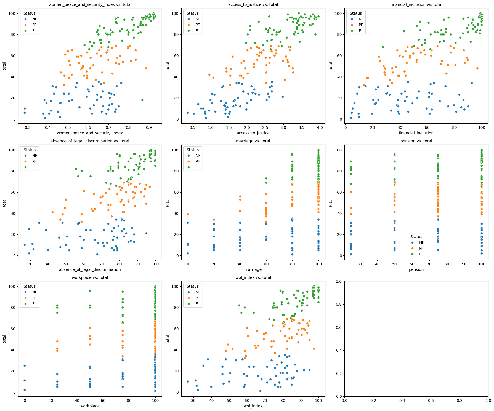

# Compare Democracy Indexes

For more details see [compare-democracy-indexes.ipynb](compare-democracy-indexes.ipynb)

## Merge datasets

Here I loaded the democracy related datasets (In the case of time-series datasets, I loaded the last year snapshots). Then I merged them into a single dataframe using the country ISO3 code as the key.

## Correlation matrix

From each dataset I took the main index:

- "polity": Polity5 index
- "total": Freedom in the World total score
- "pr_rating" and "cl_rating": Freedom in the World dataset scores. The are higher when the total score is lower
- "democracy": Boolean indicator of democracy
- "lexical_index": Index of the LIED dataset
- "lexical_index_plus": Extension of the "lexical_index" score, which adds one point if the country has political liberties, to distinguish democracies from polyarchies

There is a correlation of about 0.8 between Polity5, Freedom in the World and the LIED indexes. Some indexes are calculated as an average between results of a survey, others define a series of boolean variables representing country characteristics and then sum up the results. Even then, there is still a strong correlation, which reinforces the trustworthiness of the indexes.

## Logistic Regression

The "democracy" column is a boolean variable. I ran a logistic regression to see which predictors are more important to predict if a country is democratic or not.

Because all the predictors are highly correlated, the logistic regression doesn't choose any predictor as more significant than others.

I ran the logistic regression with regularization to force it to pick less predictors. In this case, the Freedom in the World total score was the most significant predictor.

Then I ran another logistic regression but including all the predictors. The results were the same, the "total" is chosen as the most significant by far.

This means that Freedom in the World dataset would be more important for our analysis compared to the Polity5 dataset.

# Women Rights and Democracy Datasets

For more details see [women-rights-and-democracy.ipynb](women-rights-and-democracy.ipynb)

## Merge datasets

Based on the previous analysis, I focused on the Freedom in the World dataset on the democracy side, as the "total" predictor in this dataset was the most significant.

On the Women Rights side I have two datasets:

- Georgetown - Women Peace and Security Index
- World Bank - Women, Business and the Law

I merged them into a single dataframe using the country ISO3 code as the key. This left 173 countries in the merged dataset.

## Linear Regression

I ran a linear regression with the main predictors of the Georgetown and World Bank datasets against the Freedom in the World total score. The R-square was very low (0.17). I did one test without standardizing the predictors and the R-square around 0.70, but the predictors were mostly chosen given their dimension, which make it very difficult to compare them.

### LASSO Regression

Then I ran a LASSO regression with L1 regularization to force the model to choose the most important predictors. This shows (Similarly to the linear regression), than "access_to_justice" is the most important predictor, with an R-square of 0.67.

I ran a second LASSO regression without the "access_to_justice" predictor and the R-square score went down to 0.54. Now the main predictor is "women_peace_and_security_index". This is important because it's the global score of the Georgetown dataset, compared against the "total" score of the Freedom in the World dataset.

## Analysis of simple correlations

Based on the information obtained from the linear regressions. I created a series of scatter plots to visualize the relationship between total predictors and the freedom total score. The results where what I expected. The "access_to_justice" shows a clear correlation, while the Georgetown Women Peace and Security Index too. The World Bank dataset predictors don't show a correlation.



### Residuals Analysis

The residuals analysis shows there aren't severe outliers. No record has a residual greater than 3. I analyzed the leverage using Cook's distance and the max value is 0.059, which also indicates there are not outliers.

## Access to Justice

The "access_to_justice" predictor comes from the Georgetown dataset and based on the reference it means:

```
Access to justice is V-Dem (Varietes of Democracy) indicator based on expert judgements/responses to question "Do women enjoy equal, secure, and effective access to justice?" This question specifies the extent to which women can bring cases before the courts without risk to their personal safety, trials are fair, and women have effective ability to seek redress if public authorities violate their rights, including the rights to counsel, defense, and appeal. Ordinal responses are converted to interval scale by the Bayesian item response theory measurement model.
```

So this has been extracted from the V-Dem dataset. Looking at the reference of this dataset:

```
3.8.2.4 Access to justice for women (C) (v2clacjstw)
Project Manager(s): Pamela Paxton, Svend-Erik Skaaning
Additional versions: *_osp, *_ord, *_codelow, *_codehigh, *_sd, *_mean, *_nr
Question: Do women enjoy equal, secure, and effective access to justice?
Clarification: This question specifies the extent to which women can bring cases before the courts
without risk to their personal safety, trials are fair, and women have effective ability to seek
redress if public authorities violate their rights, including the rights to counsel, defense, and
appeal.
This question does not ask you to assess the relative access to justice men and women. Thus, it is possible to assign the lowest possible score to a country even if men and women enjoy equal — and extremely limited — access to justice.
Responses:
0: Secure and effective access to justice for women is non-existent.
1: Secure and effective access to justice for women is usually not established or widely respected.
2: Secure and effective access to justice for women is inconsistently observed. Minor problems
characterize most cases or occur rather unevenly across different parts of the country.
3: Secure and effective access to justice for women is usually observed.
4: Secure and effective access to justice for women is almost always observed.
Scale: Ordinal, converted to interval by the measurement model.
Data release: 1-11.
Cross-coder aggregation: Bayesian item response theory measurement model (see V-Dem
Methodology).
Citation: Pemstein et al. (2021, V-Dem Working Paper Series 2021:21); V-Dem Codebook (see
suggested citation at the top of this document).
Years: 1789-2020
```

I'd like to make a point at:

```
This question does not ask you to assess the relative access to justice men and women. Thus, it is possible to assign the lowest possible score to a country even if men and women enjoy equal — and extremely limited — access to justice.
```

This means the "access_to_justice" predictor is strongly influenced by the democracy level of a country, if population in general, no matter gender, doesn't enjoy access to justice, the score will be low.

This means this predictor correlation with the democracy indexes is almost fixed and doesn't add any information in this analysis.

