# The Correlation Between Democratic Governance and Women's Rights: A Global Analysis of Gender Equality in Democratic and Autocratic Regimes

**Damian Calabresi**  
*University of Maryland*

## Abstract

Across the globe, the decline of democracy has been accompanied by a marked regression in women's rights, along with a broader reduction in human rights protections. Far-right political movements have gained traction, fueling a conservative ideological resurgence that challenges gender equality and often portrays feminist policies as threats to traditional societal structures. This ideological backslash affects not only women's rights but also the human rights framework that promotes equality and justice for all. On the other side, left-leaning governments, mostly formed during socialist and communist revolutions, implement profound changes in societal structures, human right policies, and public government access. 

This study investigates the relationship between democracy and human rights, with a focus on women's rights, while accounting for cultural, religious, and economic contexts. It finds that women's equality is strongly correlated with democratic governance, particularly in countries across the Americas, Europe, and Asia. The correlation is especially pronounced in legal frameworks addressing equality in marriage, pension benefits, equal pay, and maternity leave. The relationship is weaker in countries in Africa and Oceania.

**Index Terms**—democracy, women's rights, gender equality, human rights, political systems, cultural analysis

## I. Introduction

### A. Context

The second half of the 20th century saw significant progress in women's rights, alongside the broader defense of human rights [4]. Over time, various achievements in different parts of the world led to both advances and setbacks in areas such as abortion rights, women's suffrage and government representation, workplace equality, and access to justice in cases of gender-based violence.

Some of the rights secured by feminist movements include mobility, freedom, and travel independence; anti-harassment and anti-discrimination protections in the workplace; equal pay for work of equal value; participation in the industrial workforce; equality in marriage and divorce laws; condemnation of domestic violence; maternity leave and protections for pregnant workers; access to credit and business participation; equal inheritance and administrative authority; recognition of non-monetary household contributions; access to pensions and retirement programs; and childcare benefits.

These advancements have typically occurred in countries aligned with democratic and progressive governance. However, progress is neither linear nor guaranteed. The feminist movement has encountered setbacks during periods of cultural shifts, economic downturns, or a return to conservative governments.

The presence of checks and balances [1] among government branches is an important tool to protect human rights and promote equality in a civic society.

### B. Motivation

Over the last decade, a resurgence of conservative ideologies and authoritarian, populist leaders—predominantly from far-right backgrounds—has compromised these institutional safeguards while targeting feminist movements and women's rights as part of broader campaigns against democratic principles and human rights protections [2]. This backlash manifests through:

1. **Rhetorical Attacks**: Public narratives that undermines gender equality policies, often framing them as threats to traditional gender roles and family structures.  
2. **Policy Regression**: Rollback of provisions related to gender equality, reproductive rights, and mechanisms safeguarding women against violence.  
3. **Political Marginalization**: Attempts to diminish women's political participation by promoting narratives that confine women to subordinate societal roles.

These ideologies usually consider themselves to act according to the democratic principles. However, there is no democracy when the participation of women is diminished. Throughout history, women's rights have been closely tied to democratic stability, human rights protections, and the rule of law. On the other hand, the systemic erosion of these rights frequently signals broader democratic backsliding. While no democratic regime is entirely free from gender-based restrictions, the systematic regression of women's rights under authoritarian rule stands as a critical indicator of democratic decline.

### C. Hypothesis

It's widely accepted that authoritarian regimes tend to suppress the rights of women and minorities, and democratic values are important to protect human rights. This study hypothesizes a positive correlation between the level of democracy in a country and the strength of its protections for women's rights.

To examine this relationship globally, it is necessary to consider the cultural, religious, and economic values of each country, as this relationship is different on countries with distant cultures and traditions. We believe the religion and religious diversity of a country serve as limited proxies for cultural variation.

### D. Contribution

Existing literature has focused on the relationship between democracy and women rights without rigorous measurement and comparison of the relevant indicators. Those that have been done [4], search for global correlations without separating countries by continent, religion, or economic status. This paper aims to address those gaps by doing a segmented, exhaustive analysis that accounts for these cultural differences.

## II. Literature Review

### A. Previous Work

Behr et al. [4] conducted an exhaustive analysis of the laws and regulations created in each country over the years and how they affect 8 legal indicators of women's equality. They translated the legal framework of 190 countries into 8 measurements. The research analyzes women's legal rights across eight domains: Mobility, Workplace, Pay, Marriage, Parenthood, Entrepreneurship, Assets, and Pension.

This study includes an exhaustive analysis of the laws and regulations created on each country over the years and how they affect 8 legal indicators of women's equality. They translated the legal framework of 190 countries into 8 measurements. The research analyzes women's legal rights across eight domains: Mobility, Workplace, Pay, Marriage, Parenthood, Entrepreneurship, Assets, and Pension.
The paper presents a comprehensive analysis of the role and importance of active civil society organizations and women's rights groups in advancing legal gender equality.
The results reveal that higher levels of democracy and a more active civil society are positively associated with advances in legal equality between men and women.

However, the study found only limited correlation between democratic governance—as measured by the Polity5 dataset—and the eight legal indicators, with the Workplace domain being the sole significant exception. Importantly, the analysis does not account for potential confounding variables such as regional, cultural, or religious differences, which may influence both democracy levels and its correlation with gender equality measurements.

## III. Methodology

### A. Data Collection

Data were collected through online research and by consulting reputable institutions and organizations that study the intersection of democracy and women's rights. The datasets used for this investigation are:

1. World Bank Group [3]: Women, Business and the Law 1.0 Data for 1971-2024
2. Georgetown Institute for Women, Peace and Security [4]: Women Peace and Security Index
3. Center for Systemic Peace [6]: The Polity Project
4. Freedom House [7]: Freedom in the World
5. Harvard Dataverse [8]: Lexical Index of Electoral Democracy (LIED)
6. Harvard Dataverse [9]: Boix-Miller-Rosato Dichotomous Coding of Democracy
7. Pew Research Center [10]: Religious Diversity Index (RDI) Table

#### 1. Women, Business and the Law

Provided by the World Bank Group, it's based on the law framework of each country. It evaluates a series of yes or no questions based on the available laws. The questions are grouped in eight sections: Mobility, Workplace, Pay, Marriage, Parenthood, Entrepreneurship, Assets, and Pension. Each section provides a score based on the number of positive answers. The WBL Index is the sum of all the sections.

#### 2. Women Peace and Security Index

Developed by the Georgetown Institute for Women, Peace and Security, this dataset is based on surveys. It defines a series of predictors and the value is based on the number of women that provided a positive answer. Is based on three dimensions: Inclusion, Justice, and Security.

#### 3. The Polity Project

Developed by the Center for Systemic Peace, this dataset is based on expert assessments. It analyzes eight basic features of a democracy and provides a score from 0 to 10 for the autocracy, democracy, and polity levels, being polity the combination of democracy and autocracy.

#### 4. Freedom in the World

Created by Freedom House. It analyzes political and civil rights since 2013. It groups a series of questions in 7 categories. Each category contains 3 to 4 questions and provides a score from 0 to 4, being 4 the highest score. The Total democracy index is the sum of all the categories.

#### 5. Lexical Index of Electoral Democracy (LIED)

Created by the Harvard Dataverse. It analyzes the electoral system of each country and provides a score from 0 to 10 for the electoral democracy index.

#### 6. Boix-Miller-Rosato Dichotomous Coding of Democracy

Also from the Harvard Dataverse, this dataset provides a binary classification of political regimes. Countries are coded as democratic (Yes) or non-democratic (No) based on the presence of core democratic institutions.

#### 7. Religious Diversity Index (RDI)

Produced by the Pew Research Center, this dataset provides the population distribution of religious affiliations within each country, grouped into the following categories: Christian, Muslim, Jewish, Buddhist, Unaffiliated, Folk, and Other. The Religious Diversity Index is calculated using the Herfindahl-Hirschman Index, which captures the probability that two randomly selected individuals in a country belong to different religious groups.

### B. Data Analysis

#### 1. Data Cleaning

All datasets were transformed to tabular format with one row per country. In the case of time-series datasets, the most recent year was selected. Numeric values were transformed to numeric types. Records with missing values were identified and examined; these were predominantly associated with regions, non-sovereign territories, or defunct political entities and were excluded from the analysis. Some typos were found in the country names and years, those were corrected. Column names were normalized to use lowercase and underscores.

In the case of the Polity dataset, the countries without sovereignty were removed, as those contain special numeric values.

Countries in the datasets were identified using the Correlates of War (COW), V-Dem, and ISO3166-1 codes. All the countries in the datasets were mapped to the ISO3166-1 Alpha-3 codes. Non-matching countries were analyzed manually and mapped to the corresponding country.

In the case of the Religious Diversity Index, the percentage of population for each religion was provided. A boolean predictor was created to identify if a country has a majority of a specific religion.

#### 2. Exploratory Data Analysis

Almost all the datasets contain a composite index with an overall score for democracy or women's rights, which is calculated using the other columns of the dataset. To avoid artificially forcing correlations, these aggregate scores were excluded from initial Principal Component Analysis (PCA). The purpose of the PCA is to identify the most important predictors on each dataset and which ones add more variance to the model, to prioritize them in the next steps. The following figures display the PCA results:

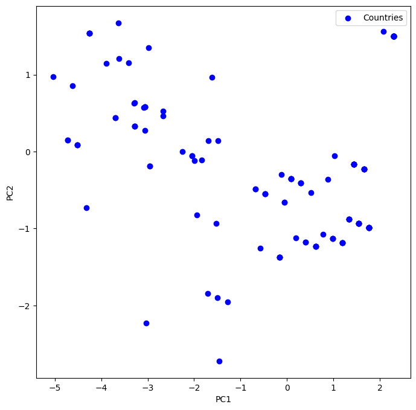

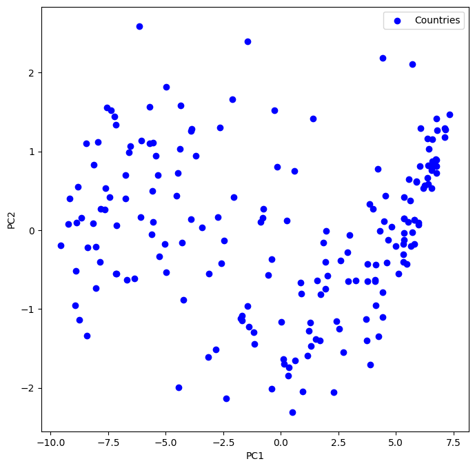

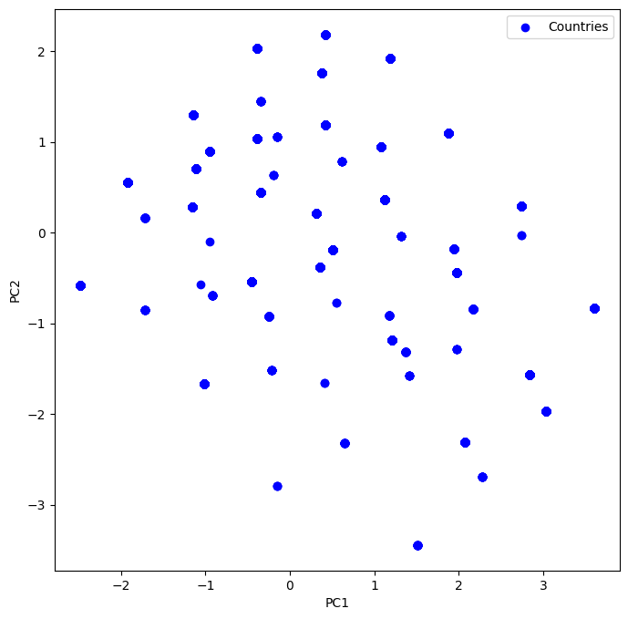

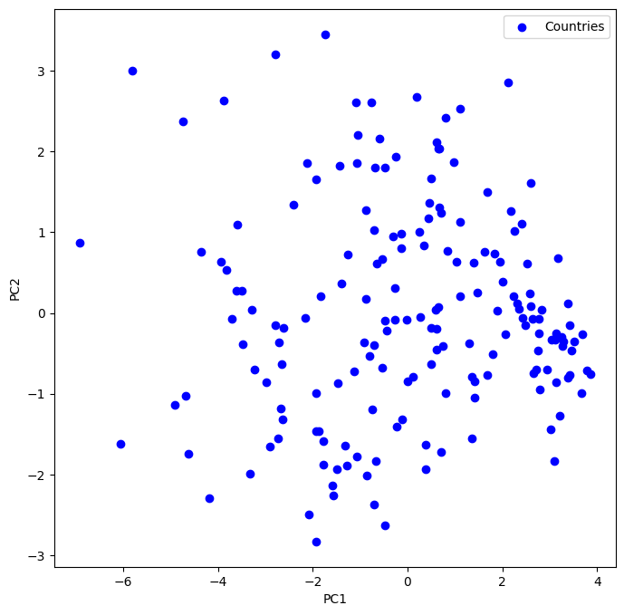

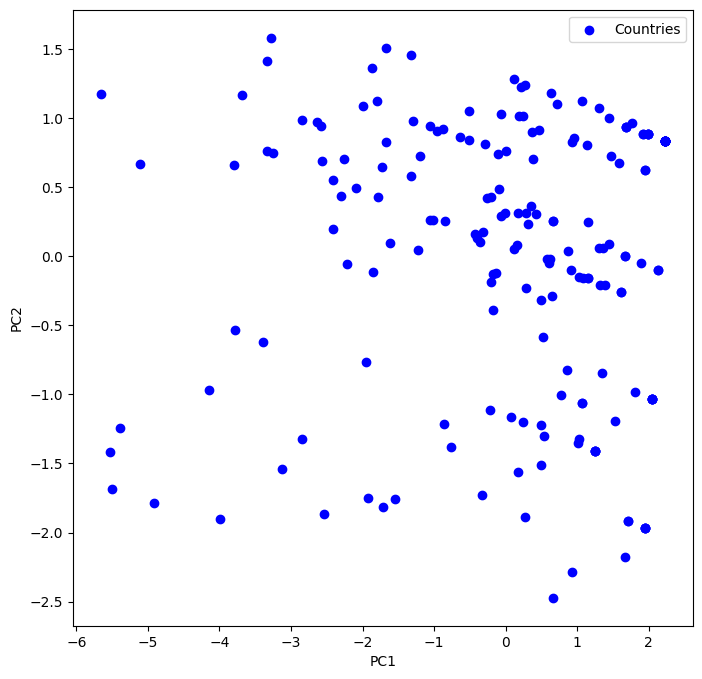

The coefficients of the first and second principal components of each dataset show that all the predictors are almost equally important and they cannot be discarded.

A correlation matrix was created for each dataset to identify if specific predictors deemed a specific analysis or understand if the overall score could be used when comparing datasets.

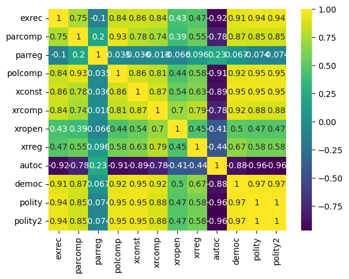

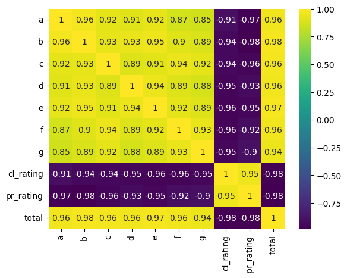

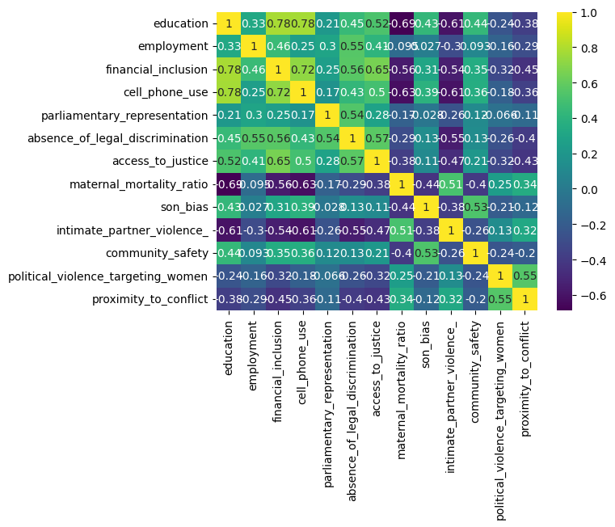

The predictors of the Women Peace and Security Index which are not correlated with the rest will require a special consideration during the analysis.

To further validate the datasets, linear regression was run for each dataset to verify that predictors are correlated with the overall score. As expected, given the correlation enforced by the calculation, all the predictors added similar value to the global predictor.

We examined the relationship between the Boolean "majority religion" variable (derived from the Religious Diversity Index dataset) and the diversity score itself. The analysis demonstrated that countries with Christian and Muslim majorities tend to exhibit lower religious diversity.

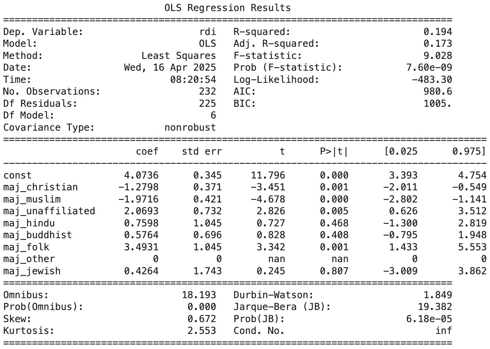

#### 3. Democracy Index Comparison

The global democracy scores from each dataset were compared to assess alignment and validity. The results are shown in the following figure:

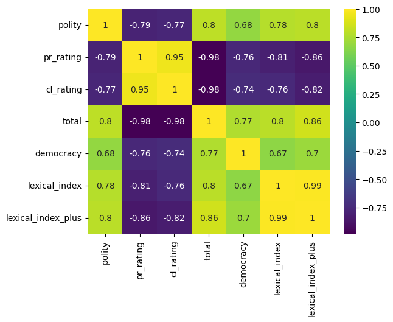

The correlation matrix demonstrates that all the datasets are highly correlated, meaning that any of them can be used to find a correlation with the other datasets. The Freedom in the World dataset emergesas the most detailed, containing more categories and a more granular analysis ("total" score in the correlation matrix). Notably, its "total" democracy score exhibited a correlation of 0.77 with the Dichotomous Coding of Democracy variable. Given that the latter is a binary classification, this represents a strong correlation.

### C. Implementation

#### 1. Modeling techniques

Three modeling techniques were employed in this study:

1. Support Vector Machines (SVM) were used to analyze the relationship between democratic and non-democratic countries visually and identify patterns. PCA was used to reduce the dimensionality of the data, enabling the SVM algorithm to provide a visual representation of the data.

2. Linear Regression and LASSO were used for quantitative analysis of the relationship between women's rights and democracy. These methods provide numerical results and a measure of significance for each predictor. Before the execution of regression models the predictors were normalized to have a mean of 0 and a standard deviation of 1.

3. Hierarchical Clustering was used to group countries based on their democracy index as well as women's rights indicators. The resulting clusters were then interpreted visually to explore patterns and similarities.

#### 2. Assumptions

Based on the previous analysis of the dataset and the high correlation between predictors in the datasets, we assumed that the primary indicator of each category can be used for the comparative analysis. For instance, the Women, Business and the Law dataset provides a score for each of the 8 categories, and the WBL Index is the sum of all of them. We decided to use these eight categories for the comparison.

The Freedom in the World dataset provides the best granularity and detail on the assessment of democracy levels. Correlation matrices confirmed that the "total" score is the most reliable continuous indicator of democracy.

The Dichotomous Coding of Democracy dataset provides a binary value for each country, being 1 a democracy and 0 a non-democracy. This dataset replaced the Freedom in the World scores in SVM-based classification analysis.

#### 3. Performance evaluation

SVM algorithm results were evaluated visually and corroborated with linear regression results.

Linear Regression and LASSO were evaluated using the R-squared and the p-values of the coefficients. Predictors with p-values below 0.05 were considered statistically significant. An R-squared value above 0.5 was taken as indicative of a meaningful correlation.

#### 4. Feature selection

Linear Regression demonstrated which predictors were significant for the correlation. Among those features categorized as significant, the ones with higher coefficients were selected for the final analysis. When Linear Regression provided similar coefficients for multiple features, a LASSO regression was applied to enforce the selection of the most important features.

The Georgetown datasets showed a high correlation that occurred because the source of these datasets is very similar and countries with more economic development will score higher in the Women Peace and Security Index despite the differences between men and women in the given society.

The analysis of the Women, Business and the Law dataset revealed that the most important features to predict the democracy of a country are: Marriage, Pension, Pay, and Parenthood.

#### 5. Data enrichment and segmentation

The democracy dataset, Freedom in the World, was merged with the "Women Peace and Security Index" and the "Women, Business and the Law" datasets. This combined dataset was then enriched with the "Religious Diversity Index" to provide a more detailed analysis of the relationship between religion and democracy. Finally, a continent classification was added for regional segmentation.

During the analysis, correlation was examined within subgroups of countries that belong to specific continents or with specific majority religions. This segmentation led to the decision to conduct separate analyses for three distinct groups, classified by:
1. Countries in America, Europe, and Asia
2. Countries in Africa and Oceania
3. Countries with Muslim majority population

## IV. Results and Discussion

### A. Results

#### 1. Women Peace and Security Index vs Freedom in the World

The correlation between the Women, Peace and Security Index (WPS) and the Freedom in the World democracy index is illustrated below:

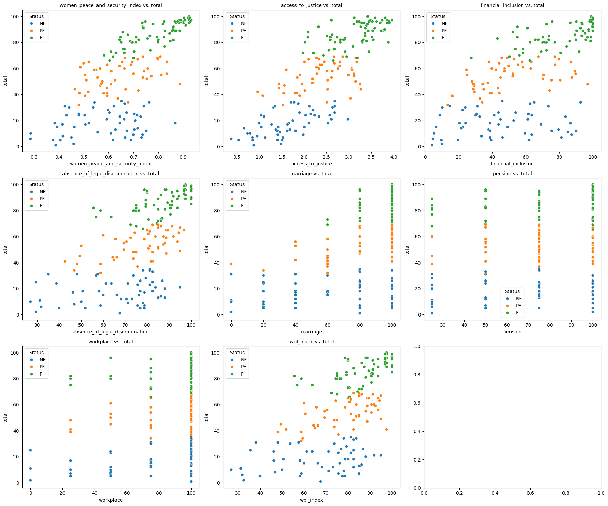

Strong correlations are observed between specific indicators—such as access_to_justice, the overall WPS index, and financial_inclusion—and the democracy index. However, a deeper examination of the dataset reveals important limitations. The WPS index is survey-based and does not explicitly compare the status of women relative to men within each country. For instance, access_to_justice is measured by the percentage of women who report feeling safe accessing justice, which is more closely tied to the overall strength of the judiciary than to gender-specific legal protections. As a result, this index may reflect general governance quality more than gender-specific disparities.

#### 2. Women, Business and the Law vs Democracy

Support Vector Machine (SVM) analysis using the Women, Business and the Law (WBL) and Freedom in the World datasets produced the following classification:

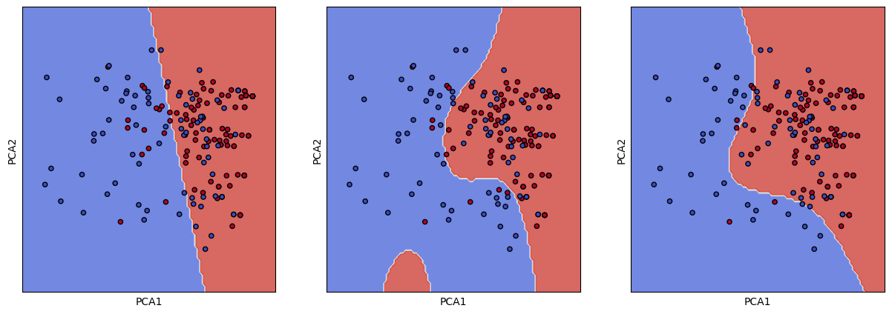

Three kernel types—Linear, Radial, and Polynomial—were tested. The Radial kernel yielded the best performance. The corresponding confusion matrix is shown below:

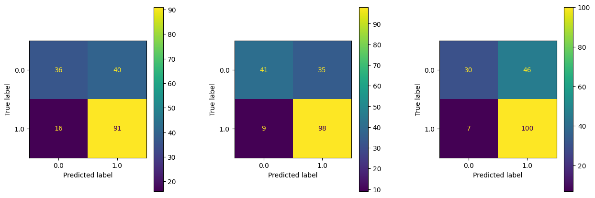

The following countries were identified as false positives (i.e., countries with high women's rights scores but classified as non-democracies):

Bolivarian Republic of Venezuela, Russian Federation, Republic of Belarus, Republic of Armenia, Republic of Azerbaijan, Republic of Côte d'Ivoire, Burkina Faso, Republic of Liberia, Togolese Republic, Federal Republic of Nigeria, Gabonese Republic, Central African Republic, Republic of Uganda, United Republic of Tanzania, Republic of Rwanda, Federal Democratic Republic of Ethiopia, Republic of Angola, Republic of Mozambique, Republic of Zambia, Republic of Zimbabwe, Republic of Namibia, Republic of Seychelles, United Arab Emirates, Republic of Tajikistan, Kyrgyz Republic, Republic of Uzbekistan, Republic of Kazakhstan, People's Republic of China, Kingdom of Bhutan, Federal Democratic Republic of Nepal, Kingdom of Cambodia, Lao People's Democratic Republic, Socialist Republic of Vietnam, Republic of Singapore, Solomon Islands, Republic of Fiji, Kingdom of Tonga, Independent State of Samoa

#### 3. Women, Business and the Law and Religious Diversity Index vs Democracy

The Religious Diversity Index predictor and the features indicating the majority religion of each country were incorporated to the dataset. The following figure shows the correlation between the Women, Business and the Law index and the Democracy index:

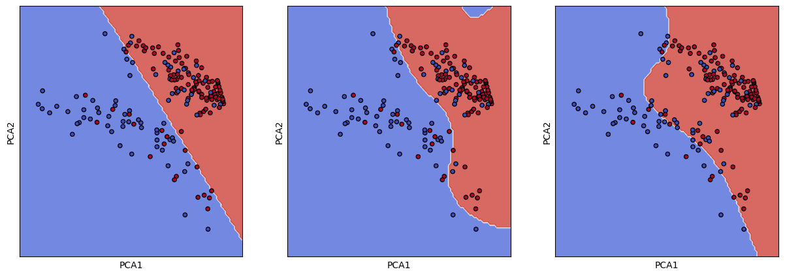

Including the RDI information generates a cluster in the PCA generated data. This new cluster is formed by countries with a majority of Christian population.

Running the SVM algorithm classifying the countries by relation provided the following results:

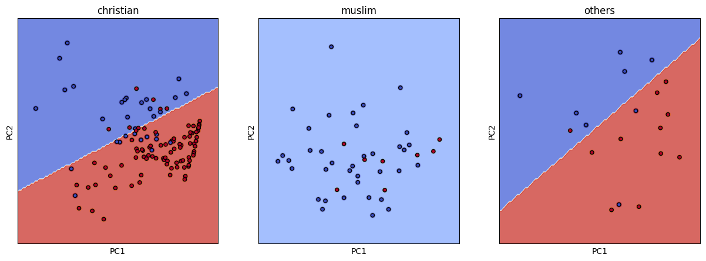

The democratic and non-democratic countries show a better separation with this segmentation. Still, the confusion matrix shows that there are some countries that are identified as false positives.

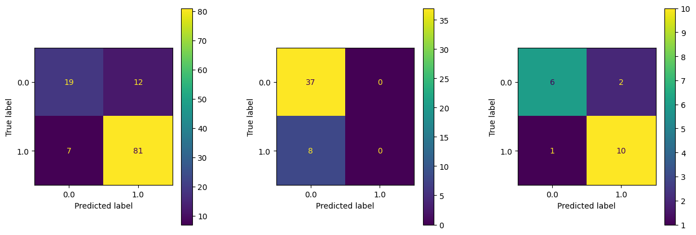

The linear regression results are shown in the following figure:

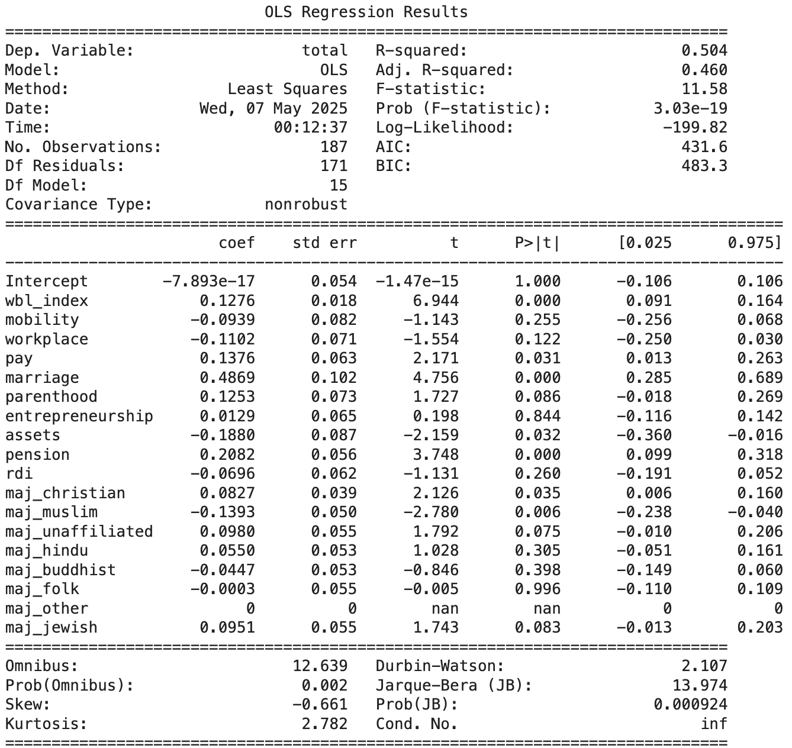

The R-squared is 0.455 and the p-values are below 0.05 for pay, marriage, and pension.

When stratified by majority religion (Christian, Muslim, or Other), model performance improved:

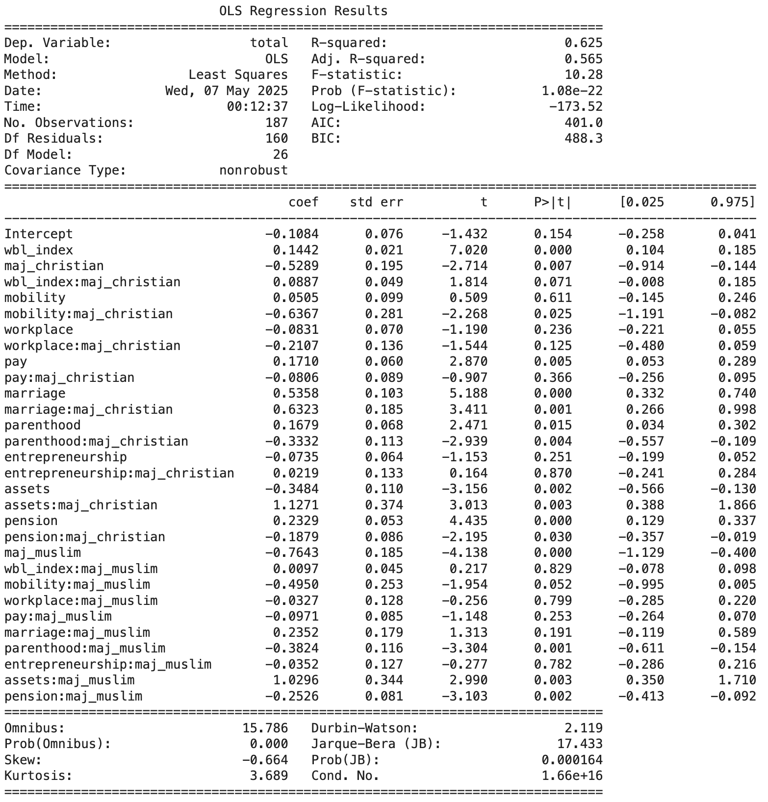

R-squared is 0.625 and the p-values are below 0.05 for WBL Index, Christian majority, Pay, Marriage, Pension, and Parenthood.

For countries without a Christian or Muslim majority, the model achieved an even higher R-squared of 0.704, with parenthood, assets, and pension as significant predictors:

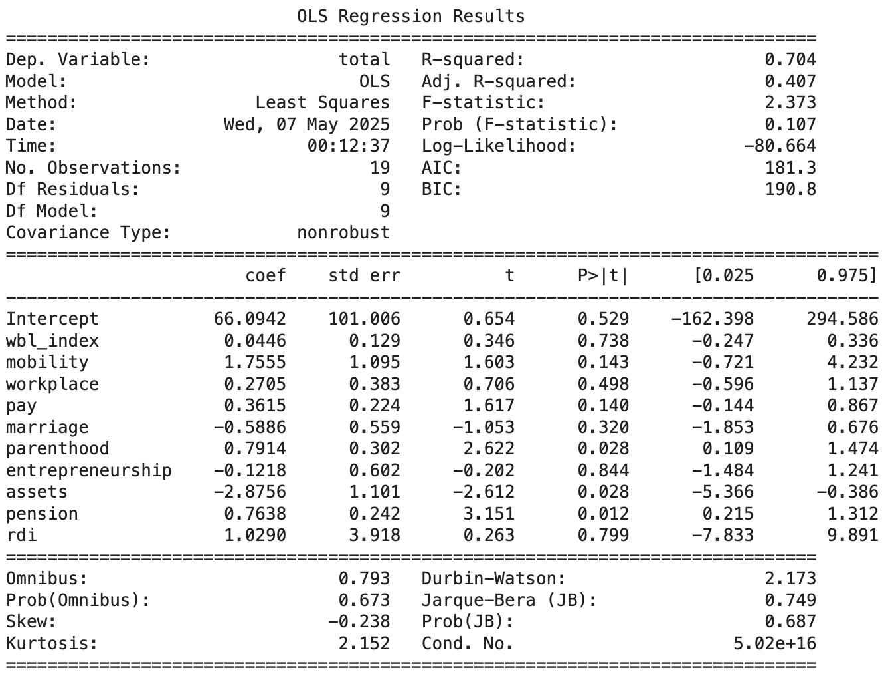

Outliers identified using Studentized Residuals are shown below:

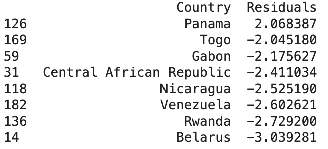

Restricting the analysis to Christian-majority countries resulted in an R-squared of 0.463, while the Muslim-majority country subset yielded a lower R-squared of 0.388.

#### 4. Women, Business and the Law, Continents, and Religious Diversity Index vs Democracy

Continent information was added to the dataset and the SVM algorithm was rerun for different segmentations. The following figure shows the SVM results when the dataset is segmented by: countries of America, Europe, and Asia; countries of Africa and Oceania; and countries with Muslim majority:

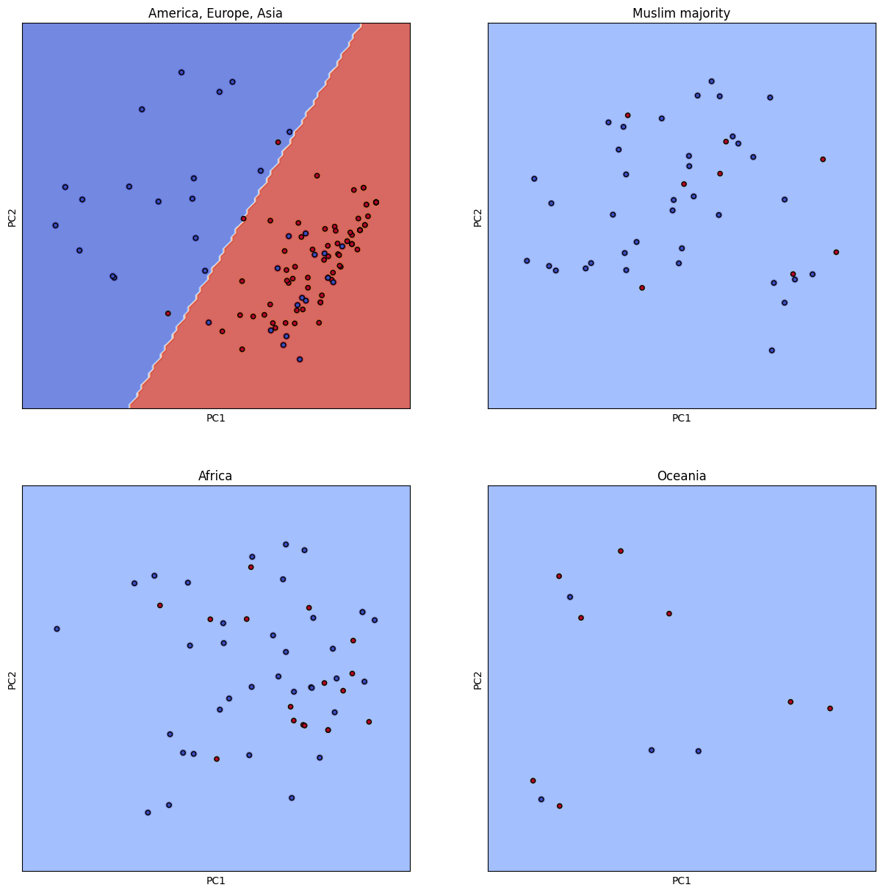

This segmentation confirmed that correlation patterns vary significantly by region and religious composition.

#### 5. Clustering

Hierarchical Clustering was conducted for the Freedom in the World dataset. The following figure shows the dendrogram:

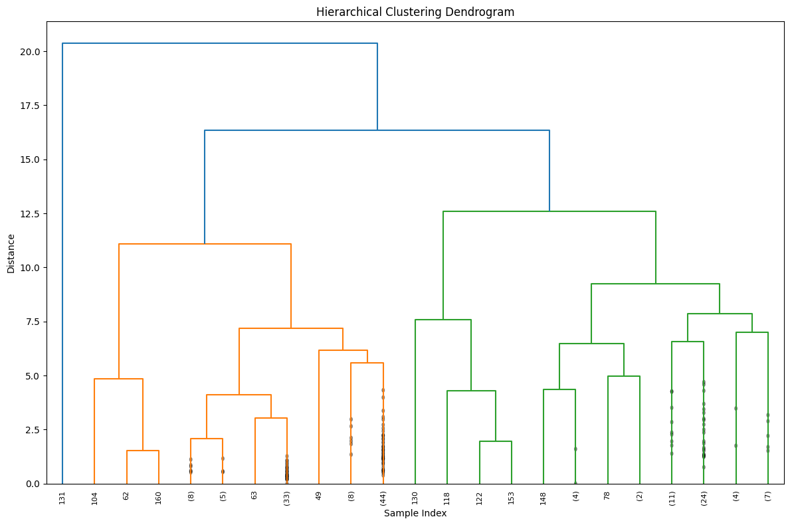

The distance threshold was set to 10 to generate 3 clusters.

A Hierarchical Clustering was also created for the Women, Business and the Law dataset. The following figure shows the dendrogram:

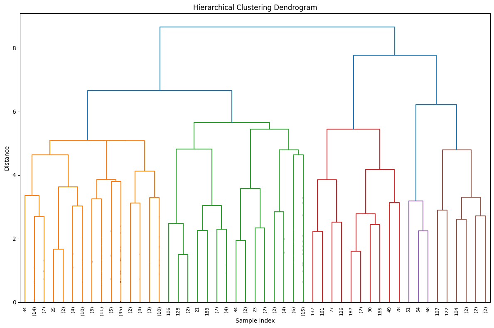

The distance threshold was set to 5 to generate 5 different clusters.

To facilitate visual interpretation, global maps were generated to illustrate the clusters on each dataset:

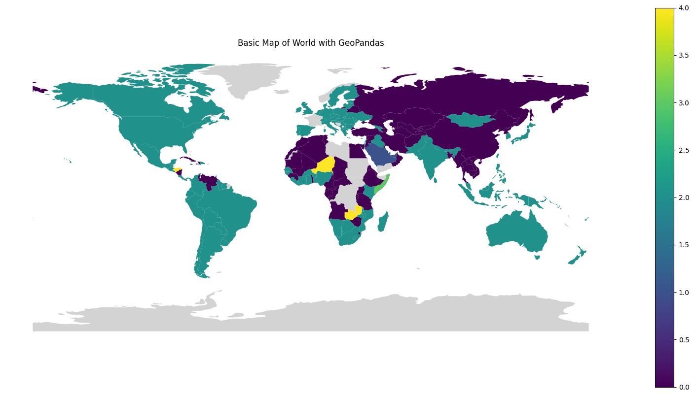

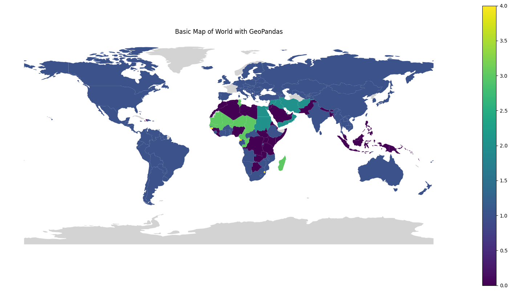

### B. Discussion

#### 1. Correlation between Women's rights and Democracy

The SVM analysis demonstrated that the Women, Business and the Law dataset serves as a useful indicator of a country's democratic status. Linear regression further confirmed a positive relationship between women's legal rights and democracy levels, although the overall R-squared values were moderate. All predictors in the WBL dataset were statistically significant and highly intercorrelated. Among them, marriage, pension, pay, and parenthood emerged as the most predictive indicators of democracy.

Segmentation of the dataset by continent and majority religion showed that the relationship between women's rights and democracy is strong in countries with higher religious diversity, particularly those without Christian or Muslim majority. Countries with a Christian majority showed a weaker correlation, while Muslim-majority countries demonstrated the weakest relationship between women's rights and democracy.

Countries in Africa and Oceania experiment a much lower correlation. When the analysis is isolated to countries in America, Europe, and Asia, the hypothesis is supported: better conditions for women, as measured by legal frameworks, are strongly associated with higher levels of democracy.

#### 2. Outliers

The analysis of the outliers based on the Studentized Residuals as well as in the SVM's confusion matrix shows two patterns of countries that are commonly missidentified:
- Former democracies that have retained laws supporting gender equality, such as Nicaragua, Venezuela, and Belarus
- Countries in Africa and Oceania, which tend to deviate from the general correlation patterns found in other regions

#### 3. Unexpected results and discoveries

The discovery of a majority of outliers in Oceania was unexpected based on the cases known to the group.

Countries related to Unaffiliated or Folk majority populations have surprisingly higher levels of democracy, religious diversity and stronger correlation between women's rights and democratic governance.

#### 4. Biases and limitations

The analysis was limited to the datasets available and the analysis was focused on the relationship between women's rights and democracy. Other important factors were not considered, like the level of development of the country, education, and income inequality. The continent information and religion dataset were used as proxies for cultural background.

## V. Conclusion

This study concludes that the legal status of women's rights within a country is a meaningful indicator of its democratic governance. The correlation between gender equality and democracy is notably stronger when countries are analyzed in regional or religious segments, particularly in America, Europe, and Asia.

However, this relationship does not hold consistently across all regions. In Africa, Oceania, and Muslim-majority countries, the correlation is weaker, suggesting the presence of region-specific or cultural moderating factors.

## VI. Future Work

Future research will require the analysis of time-series data already available in the datasets collected for this investigation. The time based analysis will allow us to understand what comes first, the variations in democracy or women's rights, and to understand the causality of the relationship.

## References

[1] E. Ortiz, J. Allen, R. U. Nagel, and J. M. Smith, "Exploring the Links between Women's Status and Democracy," Georgetown Institute for Women, Peace and Security, Washington, DC, 2023. [Online]. Available: https://giwps.georgetown.edu/wp-content/uploads/2023/03/Exploring-the-Links-between-Womens-Status-and-Democracy.pdf

[2] W. Grzebalska and A. Pető, "The gendered modus operandi of the illiberal transformation in Hungary and Poland," Women's Studies International Forum, vol. 68, pp. 164–172, 2018. [Online]. Available: https://doi.org/10.1016/j.wsif.2017.12.001

[3] World Bank Group, "Women, Business and the Law 1.0 Data for 1971–2024," 2024. [Online]. Available: https://wbl.worldbank.org/en/wbl-data

[4] D. M. Behr, C. Perrint, M. Hyland, and T. Trumbic, "Empowering Change: Assessing the Role of Democracy, Civil Society, and Women's Rights Groups in Advancing Legal Gender Equality," Policy Research working paper, no. WPS 10788, World Bank Group, Washington, D.C., 2024. [Online]. Available: https://doi.org/10.60572/aqdz-9671

[5] Georgetown Institute for Women, Peace and Security, "Women Peace and Security Index," 2024. [Online]. Available: https://giwps.georgetown.edu/the-index/

[6] Center for Systemic Peace, "The Polity Project," 2024. [Online]. Available: https://www.systemicpeace.org/polityproject.html

[7] Freedom House, "Freedom in the World," 2024. [Online]. Available: https://freedomhouse.org/report/freedom-world

[8] Harvard Dataverse, "Lexical Index of Electoral Democracy (LIED)," 2024. [Online]. Available: https://dataverse.harvard.edu/dataset.xhtml?persistentId=doi:10.7910/DVN/WPKNIT

[9] Harvard Dataverse, "Boix-Miller-Rosato Dichotomous Coding of Democracy," 2024. [Online]. Available: https://dataverse.harvard.edu/dataset.xhtml?persistentId=doi:10.7910/DVN/FENWWR

[10] Pew Research Center, "Religious Diversity Index (RDI) Table," 2024. [Online]. Available: https://www.pewresearch.org/religion/2014/04/04/religious-diversity-index-scores-by-country/

[11] Human Rights Watch, "The Fight for Women's Rights is a Fight Against Authoritarianism," Jan. 4, 2023. [Online]. Available: https://www.hrw.org/news/2023/01/04/fight-womens-rights-fight-against-authoritarianism
